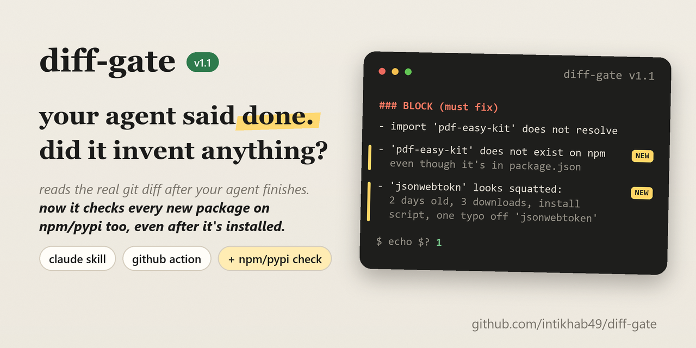
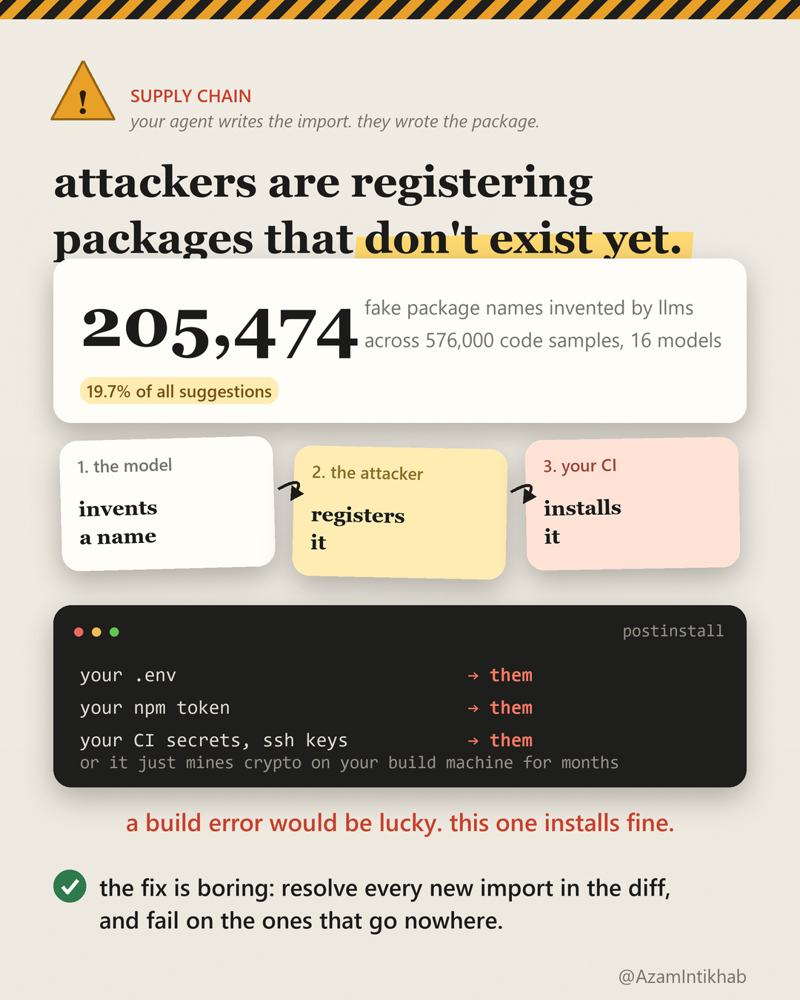

<div align="center">



# diff-gate

**Attackers are registering packages that don't exist yet. Your agent writes the import.**

A Claude Code skill and a GitHub Action that read the real `git diff` after an agent finishes and fail on imports that resolve to nothing, and on new packages that don't exist on npm or PyPI or look squatted.

[](LICENSE)
[](scripts/check.mjs)
[](#install)
[](#install)

</div>

---

## The attack

Researchers generated 576,000 code samples across 16 code-generating models and found **205,474 unique package names that exist nowhere on any registry**: at least 5.2% of packages suggested by commercial models and 21.7% by open-source ones were fiction ([We Have a Package for You!](https://arxiv.org/abs/2406.10279), USENIX Security 2025, ~19.7% across all samples as commonly reported).

Those names repeat. The same model invents the same fake package for the same kind of task, which turns a hallucination into a predictable address. An attacker registers the name, waits, and eventually an agent writes the import and a CI job runs `npm install`.

What arrives is not a build error. A build error would be lucky. It is a package that installs fine, and whose install script can read your `.env`, your npm token, your CI secrets and your SSH keys, or quietly mine crypto on your build machine for months.



Your agent cannot protect you here. It wrote those imports from memory and has no idea which ones are real. A prompt cannot tell a real package from an imagined one either; you can instruct a model never to invent imports and it will still invent them, because it does not know that it did.

A resolver and a registry lookup can. That is all this is.

An import that points at nothing is the easy case. The harder one is an agent that also adds the name to `package.json`, or runs `npm install` on it: the import now resolves, and a check that only looks at your disk passes it. So since v1.1, every dependency the diff adds is also looked up on npm or PyPI.

A real run: the agent wrote `import jwt from "jsonwebtokn"` (one letter off `jsonwebtoken`) and added it to `package.json`.

```console
$ node scripts/check.mjs
## diff-gate vs HEAD
2 file(s) changed, 1 new, +6 / -1 lines

### BLOCK (must fix)
- package.json: 'jsonwebtokn' does not exist on the npm registry: invented package name. Remove it; never register or install a name to make this pass

### WARN (fix, or justify in one line)
- package.json: new dependencies jsonwebtokn@^9.0.2: for each, name what it replaces or why the stdlib or existing deps can't do it

$ echo $?
1
```

If someone had already registered `jsonwebtokn`, the name would exist and that first line would not fire. The squat rule would: a package first published under 30 days ago, with under 1,000 downloads a week, that also runs an install script or sits one typo from a popular name, is a BLOCK too.

## What it checks

It runs after the agent, on the diff it left behind, so nothing depends on the model cooperating.

| Check | Level | Why it exists |
|---|---|---|
| Imports that resolve to nothing: invented packages, made-up `@/...` aliases, missing files, Python modules that are not importable | **BLOCK** | hallucinated imports, typosquatting and slopsquatting exposure |
| New dependencies that do not exist on npm/PyPI, or look squatted: first published under 30 days ago, under 1,000 downloads a week, and an install script or a name one typo from a popular package | **BLOCK** | catches the attacker's package even after the agent installed it and added it to the manifest |
| New dependencies that are obscure, brand new, or one typo from a popular name | WARN | confirm it is the package you meant |
| New dependencies, by comparing the old and new manifest | WARN | the stdlib or an installed package usually covers it |
| A new top-level helper whose name already exists elsewhere | WARN | agents rewrite helpers they never saw |
| Tool-branded comments left in code | WARN | your repo is not an advert |
| Imports into build output, packages installed only transitively, unverified aliases, install scripts on established packages, 3+ branches or loops added with no test file touched | INFO | context, not a problem; the agent isn't asked to write code for it |

Exit code `1` on a BLOCK finding, `0` otherwise, `2` for a bad ref or a non-git directory. In CI that fails the build. In an agent session it is a report the agent is told to act on.

## Install

### Claude Code (skill)
Copy this folder to `~/.claude/skills/diff-gate/`, or `.claude/skills/diff-gate/` inside one project.

Skills do not reliably fire on their own ([measured below](#does-it-actually-run)), so add one line to your `CLAUDE.md`:

```
Before reporting a coding task done, run the diff-gate skill and fix or justify its findings.
```

### GitHub Action (CI)
```yaml
- uses: actions/checkout@v4
  with: { fetch-depth: 0 }
- uses: actions/setup-node@v4
  with: { node-version: 22 }
- run: npm ci                       # so imports resolve against what is installed
- uses: intikhab49/diff-gate@v1
  # with:
  #   fail-on: warn                 # block (default) | warn | never
  #   offline: true                 # skip the npm/PyPI lookup
```
The report lands in the job summary. Full example: [`.github/workflows/example-usage.yml`](.github/workflows/example-usage.yml).

### Any other agent, or by hand
The script has no dependencies and no config. Point Cursor, OpenCode, Codex or a git hook at it:

```bash
node path/to/check.mjs          # uncommitted and untracked work
node path/to/check.mjs main     # a whole branch
```

If your agent asks permission to read files outside the project, keep the script inside the repo, for example `.diffgate/check.mjs` listed in `.gitignore`. Some agents stall on that prompt in headless mode.

## Does it actually run?

Measured, not assumed. Six headless Claude Code sessions, Sonnet, one coding task, project settings only, skill installed:

| Setup | Ran the check |
|---|--:|
| Skill installed, nothing else | **0 / 3** |
| Skill installed + the one-line `CLAUDE.md` instruction | **3 / 3** |

A skill sitting in a folder does not fire by itself. Any skill that claims otherwise has not measured it.

## What the benchmark did *not* show

The result that does not flatter this tool, published first, with the harness beside it.

Six dependency-trap tickets (xlsx export, timezone conversion, PDF receipt, JWT auth, rate limiting, helper reuse) against a seeded Express repo, DeepSeek V4 Flash via OpenCode, four arms. 30 of 48 cells completed before the run was stopped.

| arm | usable runs | mean added LOC | new deps | invented imports | duplicated helpers |
|---|--:|--:|--:|--:|--:|
| [ponytail](https://github.com/DietrichGebert/ponytail) | 4 | **21** | 4 | 0 | 0 |
| no rules | 3 | 32 | 2 | 0 | 0 |
| ponytail + diff-gate | 9 | 30 | 3 | 0 | 0 |
| diff-gate | 4 | 62 | 2 | 0 | 0 |

- **No arm invented an import or duplicated a helper.** On a capable model the failure this tool catches did not occur in 20 usable runs. It is insurance, not a daily win.
- **diff-gate's arm wrote the most code.** Acting on its findings adds lines: a test, a real import. If you want less code, that is ponytail's job and its numbers here support it.
- A third of runs ended with the model writing nothing at all. That is the cheap model, it hits every arm equally, and it means only the large gaps are meaningful.

These numbers are for v1.0. v1.1 moved "untested logic" from WARN to INFO so the agent is no longer pushed to add test code; that has not been re-benchmarked yet.

Reproduce it: [`benchmark/seed.sh`](benchmark/seed.sh) builds the repo, [`benchmark/run.sh`](benchmark/run.sh) and [`benchmark/run-combined.sh`](benchmark/run-combined.sh) run the arms, [`benchmark/results.csv`](benchmark/results.csv) is the raw output (`exit=99` marks a run where the agent changed no code).

**Where it did earn its keep:** copy-pasted TOTP, cookie-jar and member-factory helpers across five test files in a real private repo; an invented `@/lib/...` alias import; and two bugs in its own scoring, found by reading raw diffs instead of trusting the summary.

## Limits
- Duplicates are matched by normalized top-level name, so the same logic under a different name slips through.
- Python imports are checked against the active interpreter, so run it inside your virtualenv.
- The registry lookup reads metadata only: existence, age, weekly downloads, install scripts. It never reads package code, so an old, popular package that later turns malicious passes. For that, use a dedicated scanner.
- The lookup only runs when the diff adds a dependency, 8 requests at a time, 4 s timeout each. Offline or on a failed lookup it reports INFO and never blocks; `--offline` skips it.
- JavaScript, TypeScript and Python only.
- It reads diffs. It does not run your tests and cannot tell you whether the code is correct.

## Changelog
- **v1.1.1**: on Windows the script could crash after printing the report and exit 127 instead of 1. Fixed.
- **v1.1.0**: new dependencies are looked up on npm and PyPI: missing or squatted packages BLOCK, obscure or lookalike ones WARN. "Untested logic" is now INFO. Shorter skill description. Action gets an `offline` input.
- **v1.0.1**: `fail-on: warn` no longer fails on INFO-only reports.
- **v1.0.0**: first release.

## Credit
Built alongside the conversation around [ponytail](https://github.com/DietrichGebert/ponytail) (MIT) and [andrej-karpathy-skills](https://github.com/multica-ai/andrej-karpathy-skills). Those shape what an agent writes. This one checks what it wrote. Use both.

## Contributing
Issues and pull requests welcome, especially new language support. See [CONTRIBUTING.md](CONTRIBUTING.md). Every claim in this README is reproducible from the repo, and a pull request that disproves one is a good pull request.

MIT © Intikhab Azam
